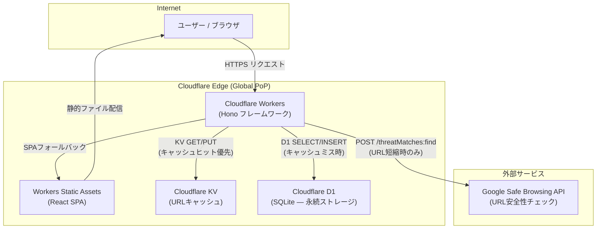
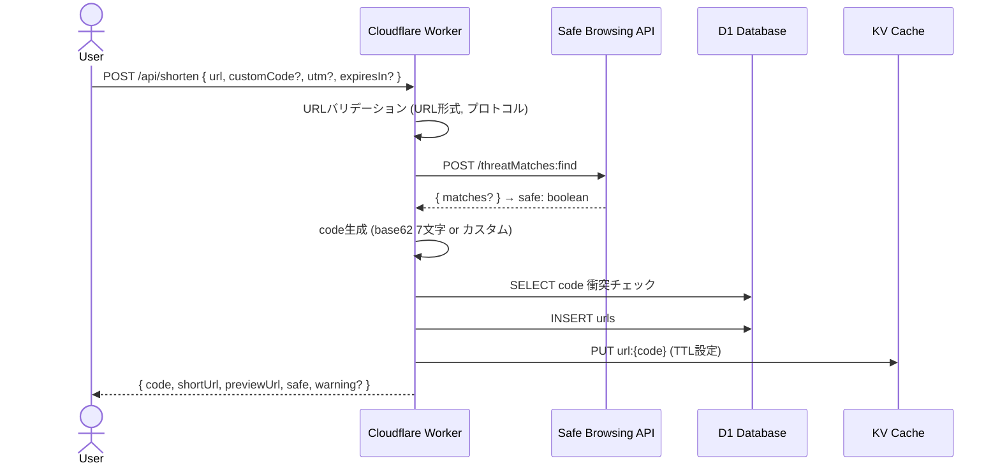
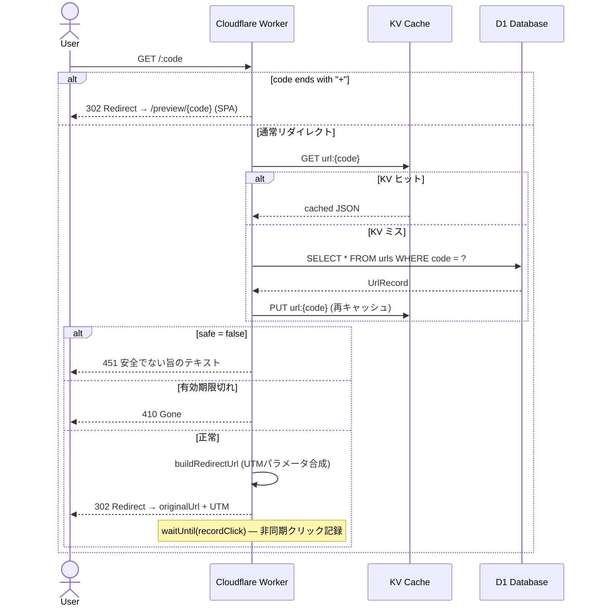
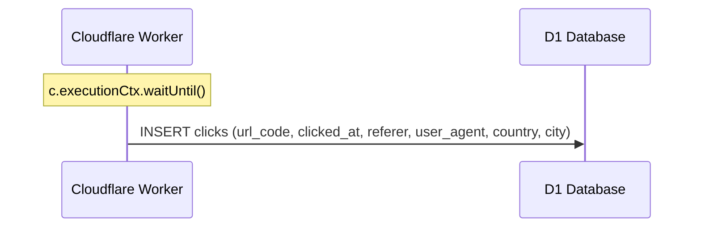
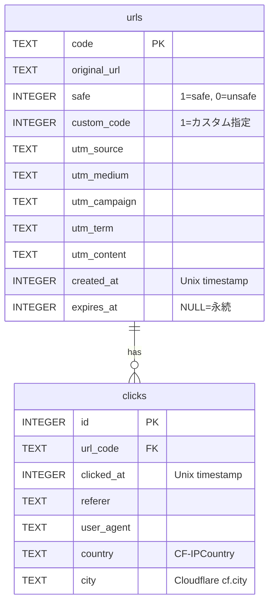
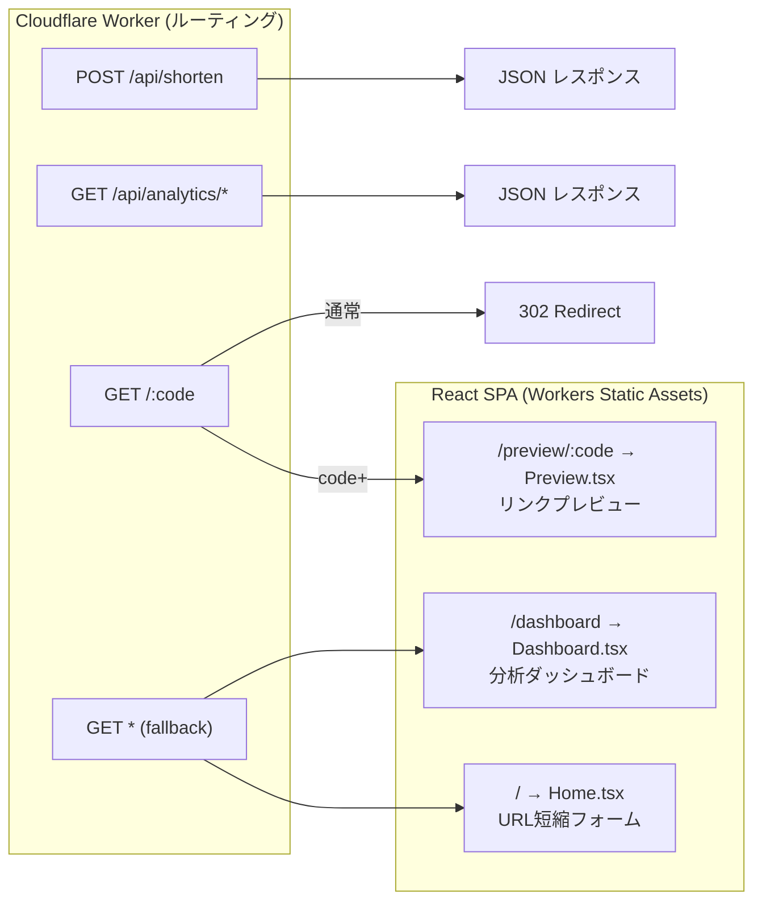

# tanshuku-url

Cloudflare完結のURL短縮サービス。Workers (Hono) + D1 + KV + Workers Static Assets で構成。

---

## インフラ構成



---

## リクエストフロー

### URL短縮 (`POST /api/shorten`)



### リダイレクト (`GET /:code`)



### クリック記録 (非同期)



---

## データモデル



---

## KVキャッシュ設計

| キー | バリュー | TTL |
|------|---------|-----|
| `url:{code}` | `{ original_url, safe, utm_*, expires_at }` JSON | `expiresIn` or 30日 |

---

## SPAルーティング



---

## セットアップ

### 前提条件

- Node.js v18+
- Wrangler CLI (`npm i -g wrangler`)
- Cloudflare アカウント

### 1. リソース作成

```bash
# D1 データベース作成
wrangler d1 create tanshuku-db
# → database_id を wrangler.toml に記入

# KV Namespace 作成
wrangler kv namespace create URL_CACHE
wrangler kv namespace create URL_CACHE --preview
# → id / preview_id を wrangler.toml に記入
```

### 2. wrangler.toml 設定

```toml
[vars]
SHORT_DOMAIN = "https://<your-worker>.workers.dev"

[[d1_databases]]
database_id = "<your-d1-id>"

[[kv_namespaces]]
id = "<your-kv-id>"
preview_id = "<your-kv-preview-id>"
```

### 3. Secrets 設定（任意）

```bash
wrangler secret put GOOGLE_SAFE_BROWSING_API_KEY
```

### 4. DBマイグレーション

```bash
# ローカル
npm run db:migrate:local

# 本番
npm run db:migrate
```

### 5. 開発

```bash
npm install
cd frontend && npm install && cd ..
npm run dev:all   # Worker (port 8787) + Vite (port 5173) 同時起動
```

### 6. デプロイ

```bash
npm run deploy    # frontend build → wrangler deploy
```

---

## API リファレンス

### `POST /api/shorten`

```json
// Request
{
  "url": "https://example.com/very/long/path",
  "customCode": "my-link",
  "utm": {
    "source": "twitter",
    "medium": "social",
    "campaign": "launch"
  },
  "expiresIn": 259200
}

// Response
{
  "code": "my-link",
  "shortUrl": "https://t.example.com/my-link",
  "previewUrl": "https://t.example.com/my-link+",
  "safe": true
}
```

### `GET /:code`

| 条件 | レスポンス |
|------|-----------|
| 通常 | 302 → `originalUrl?utm_*` |
| `+`サフィックス | 302 → `/preview/{code}` |
| 不明コード | 404 |
| 有効期限切れ | 410 |
| 安全でないURL | 451 |

### `GET /api/analytics/summary`

```json
{ "totalUrls": 42, "totalClicks": 1234, "todayClicks": 56 }
```

### `GET /api/analytics/urls?page=1&limit=20`

### `GET /api/analytics/clicks/:code?days=30`

### `GET /api/analytics/preview/:code`

---

## ローカルテスト

```bash
# URL短縮
curl -X POST http://localhost:8787/api/shorten \
  -H 'Content-Type: application/json' \
  -d '{"url":"https://example.com","utm":{"source":"test"}}'

# リダイレクト確認
curl -L http://localhost:8787/{code}

# プレビューリダイレクト
curl -L "http://localhost:8787/{code}+"

# UI確認
open http://localhost:5173
open http://localhost:5173/dashboard
```
